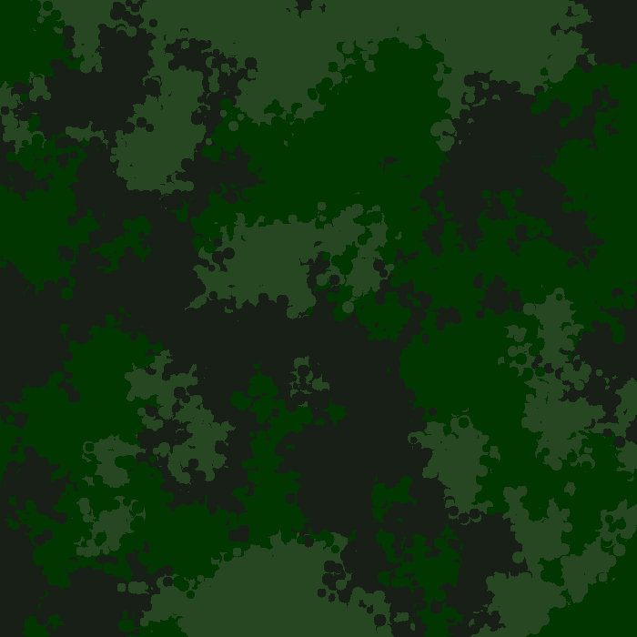
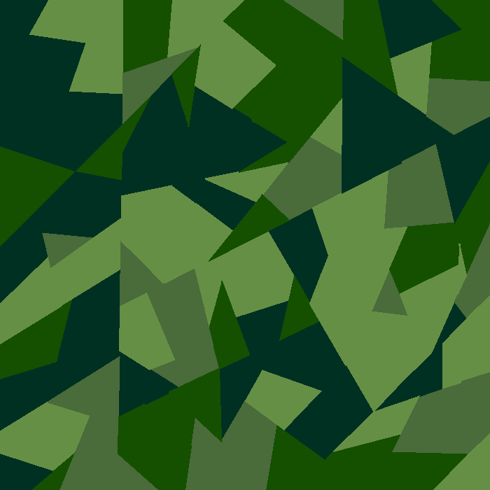
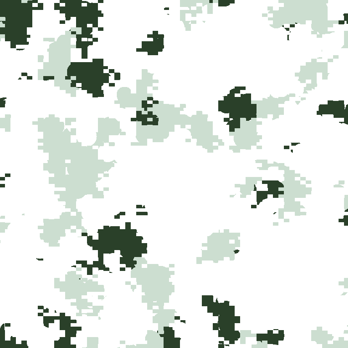
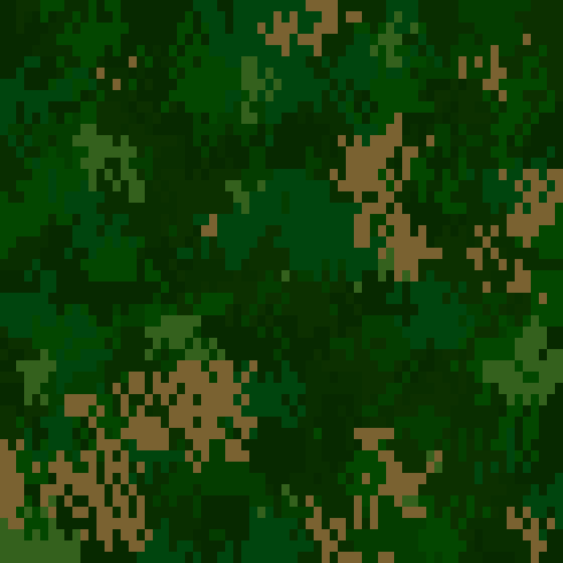
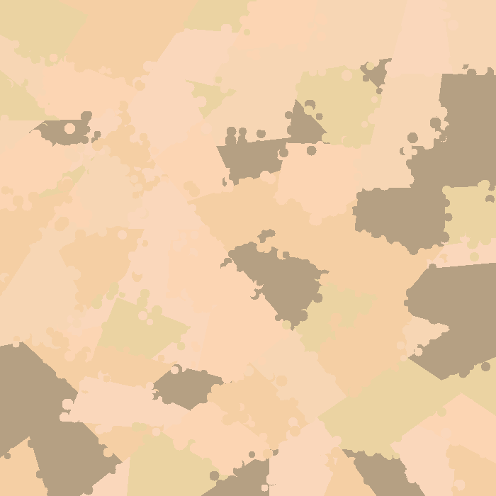
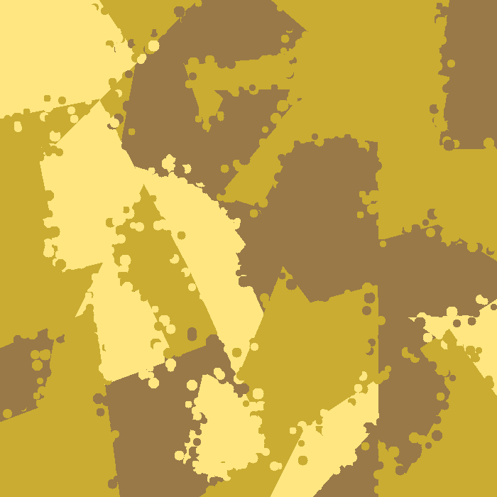
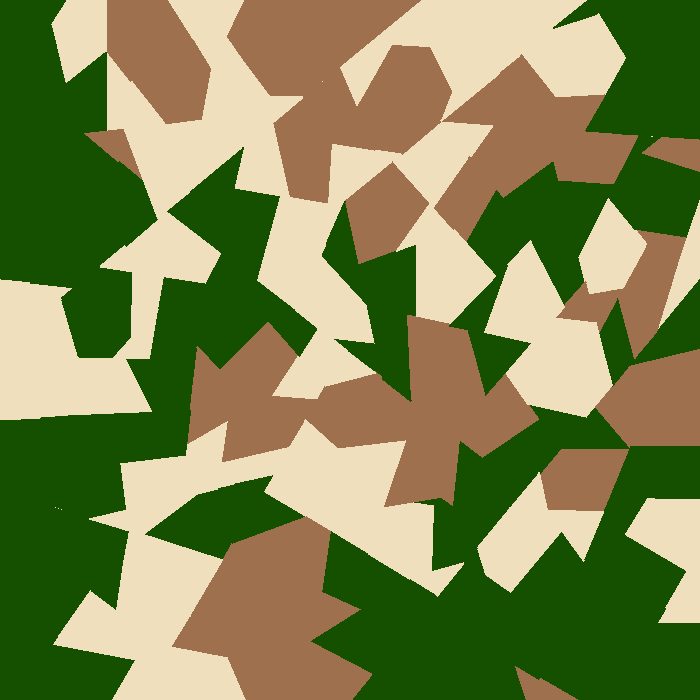

# camogen

This repository is a **camo**uflage **gen**erator. The code is originally from Ulf Åström in PHP. You can find 
his applet here: [http://www.happyponyland.net](http://www.happyponyland.net). Website seems to be down. =( I simply updated 
and wrote his code in Python instead of PHP. 

You need to install the following libraries to run the code:
```
pip install numpy Pillow
```

## How to use

Here is a very simple example how to use the generator:

```[python]
import camogen

parameters = {'width': 700, 'height': 700, 'polygon_size': 400, 'color_bleed': 0,
              'colors': ['#668F46', '#4A6B3A', '#145000', '#003022']}

image = camogen.generate(parameters)
```
The parameter `image` corresponds to the object `Image` from the package `PIL`.

### Parameters

The parameters given is a python dictionary. The following parameters are mandatory:

| Parameter    | Types        |  Explanation                                                                                          |
| ------------ | ------------ | ----------------------------------------------------------------------------------------------------- |
| width        | Int          | Width of the image (Minimum value: 0)                                                                 |
| height       | Int          | Height of the image (Minim value: 0)                                                                  |
| polygon_size | Int          | Minimum perimeter of a polygon (Minimum value: 0)                                                     |
| color_bleed  | Int          | Bleeding of the colors, *i.e.* number of neighbouring polygons with the same color (Minimum value: 0) |
| colors       | list[String] | List of all the colors. Colors have to be a Hex String. (Minimum size: 1)                             |
| max_depth    | Int          | (**Optional**) Maximum depth for creating the polygons. (Default value: 15)                           |

The next set of parameters adds spots on the camouflage. In the dictionary, you have to add these parameters with the key
`spots`. If you want to add spots, all these parameters are mandatory:

| Parameter          | Types |  Explanation                                                                                  |
| ------------------ | ----- | --------------------------------------------------------------------------------------------- |
| amount             | Int   | Number of spots (Minimum value: 0)                                                            |
| radius             | dict  | Dictionary with the min and max radius (Example: `{'min': 0, 'max': 10}`), Minimum values: 0) |
| sampling_variation | Int   | Variation for the sampling, *i.e.* how far it goes looking for the color for the spot.  |

The next set of parameters pixelizes the camouflage. In the dictionary, you have to add these parameters with the key
`pixelize`. If you want to pixelize the camouflage, all these parameters are mandatory:

| Parameter          | Types |  Explanation                                                                                       |
| ------------------ | ----- | -------------------------------------------------------------------------------------------------- |
| amount             | float | Percentage of pixelization (Between 0 and 1)                                                       |
| sampling_variation | Int   | Variation for the sampling, *i.e.* how far it goes looking for the color for the spot.             |
| density            | dict  | Density of the pixels, *i.e.* inverse of the size of the pixels. (Example: `{'x': 100, 'y': 200}`) |

You can find examples how to generate some camouflage in the file `examples.py`

## Examples

#### Green Blots


#### Mighty Swede


#### Vodka


#### Maple Warrior


#### Desert


#### Desert 2


#### Klosterschwester


## Contacts

If you have questions about the generation of this patterns, you should ask Ulf Åström. He wrote the original code. You 
can find his contact page here: [http://www.happyponyland.net/contact.php](http://www.happyponyland.net/contact.php)

If you have questions about the Python code or if you want to improve it, you can always submit an issue or a PR. You can 
also contact me using my email adress: [glederre@gmail.com](mailto:glederre@gmail.com)
